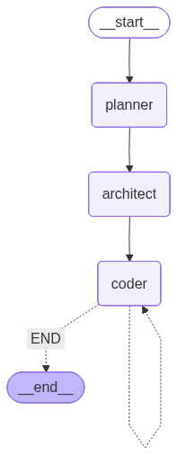

# 🛠️ LangGraph App Builder

An AI-powered application generator that converts natural language descriptions into functional projects using a multi-agent LangGraph architecture.

---

## 🏗️ Architecture

- **Planning Agent** – Creates a project plan with tech stack and features
- **Architect Agent** – Breaks down the plan into detailed implementation tasks  
- **Coding Agent** – Executes tasks and generates actual code files



---

## 🚀 Quick Start

### Prerequisites
- Python 3.11+
- Google Gemini API key
- [uv package manager](https://docs.astral.sh/uv/getting-started/installation/)

### Installation

```bash
# Create virtual environment
uv venv
.venv\Scripts\activate  # Windows
source .venv/bin/activate  # Linux/Mac

# Install dependencies
uv pip install -e .

# Setup environment
cp .sample_env .env
# Add your GEMINI_API_KEY to .env
```

### Running the App

```bash
python agent/graph.py
```

Enter your project description when prompted. Examples:
- "Create a simple login page with colorful design"
- "Build a to-do list app using HTML, CSS, and JavaScript"  
- "Create a FastAPI blog with SQLite database"

---

## 📁 Project Structure

```
agent/
  ├── graph.py      # Main LangGraph orchestration
  ├── prompts.py    # Agent prompts
  ├── states.py     # Pydantic models
  ├── tools.py      # File I/O tools
  └── visualize.py  # Graph visualization
main.py            # Entry point
pyproject.toml     # Dependencies
```
## ⚙️ Configuration

Key settings in `agent/graph.py`:

```python
llm = ChatGoogleGenerativeAI(
    model="gemini-2.0-flash-exp",
    temperature=0.2
)
```

tested opensource models with limited use because of Tokens per minute limit:
- `openai/gpt-oss-20b`
- `gemini-2.0-flash`
- `gemini-1.5-pro` (higher accuracy, slower)

---

## 📸 Example Projects

### 1. Calculator Web App
Generated simple calculator with HTML, CSS, and JavaScript.


### 2. Login Page
Beautiful login interface with responsive design.


### 3. Portfolio Website
Personal portfolio with multiple sections and responsive layout.


---

## 🐛 Troubleshooting

**Issue:** "Tool choice is required" error
- **Solution:** Model does not support structured outputs. Try a different model with better tool-use support.

**Issue:** API quota exceeded
- **Solution:** Google Gemini has rate limits. Wait before retrying or use a different model.

**Issue:** Generated project won't run
- **Solution:** Check `generated_project/README.md` for specific setup instructions.

---

----
